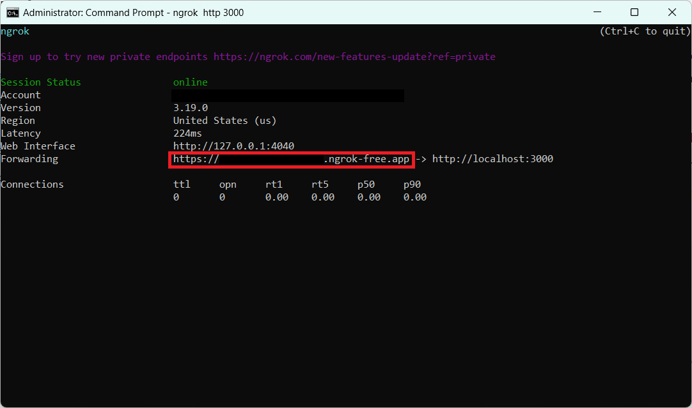
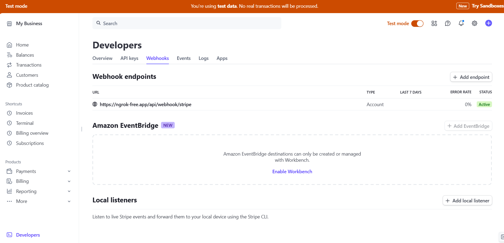
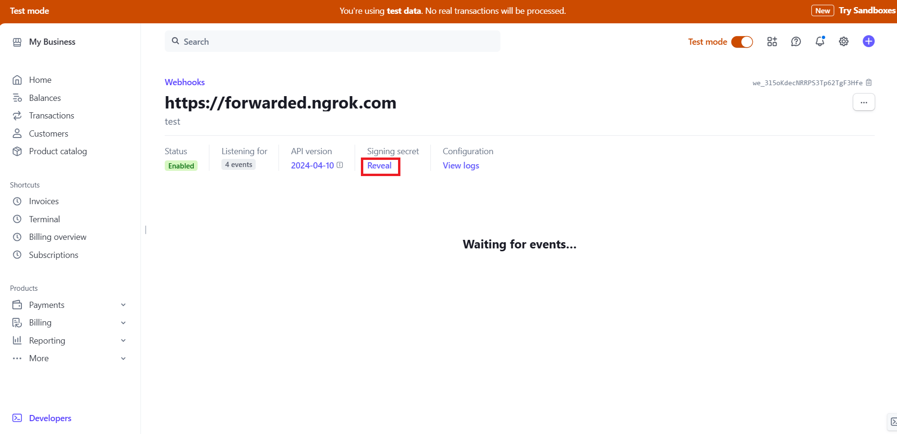
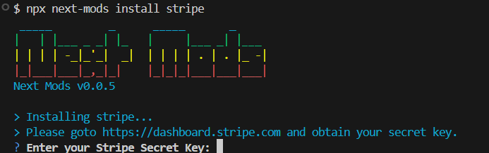

Adding Stripe payments to your app can seem like a daunting task if you haven't done it before. If you follow this guide, I will help you set up one of the core components to handling payments and subscriptions in your app; webhooks.

<!-- truncate -->

## What are Webhooks?

Webhooks are a powerful way for 3rd party services to communicate in real-time with your app, allowing a service to send automated messages or data to your app when a specific event occurs in real-time.

In the context of Stripe, [webhooks](https://docs.stripe.com/webhooks) are vital for monitoring and responding to a variety of payment events—such as successful transactions, refunds, or chargebacks—ensuring your application can react promptly and maintain synchronized data with Stripe’s payment platform. This seamless integration enhances user experience and efficiency.

## Steps to Create a Stripe Webhook

Creating a webhook is pretty straightforward. There are just a few things you need to create one but the process is pretty easy.

### Prerequisites

- A [Stripe](https://www.stripe.com) account.
- Stripe [live secret key](https://dashboard.stripe.com/apikeys) or [test secret key](https://dashboard.stripe.com/test/apikeys).
- Next Mods [initialized](../../docs/commands/init) in your Next.js project.

:::info
Make sure you use the right keys. In development, use test mode keys found [here](https://dashboard.stripe.com/test/apikeys). When you are ready for production you just need to change your key to the live one.
:::

### Step 1: Create Public Webhook Route

We need Stripe to be able to reach this webhook route, even while in development, which can seem tricky. Thankfully there is a tool called [Ngrok](https://download.ngrok.com/downloads) that makes it easy to expose the route publicly.

[Download ngrok](https://download.ngrok.com/downloads) for your operating system and you can create a public route by running the following command:

```bash
ngrok http 3000
```



Copy the fowarded address and proceed to creating the Stripe webhook in the next step.

### Step 2: Create Stripe Webhook

If you are still in development, goto the [test webhook page](https://dashboard.stripe.com/test/webhooks) to create a webhook. If you are in production, you can [goto this page](https://dashboard.stripe.com/webhooks) instead. Once there, click on `Add Endpoint`.



Fill in the following fields then click on `Add endpoint`:

- Endpoint URL: **Forwarded URL from last step**
- Description (optional): **Stripe webhook description**
- Listen to: **Events on your account**
- Version: **Your current version**
- Select events to listen to. **Add the following events:**
  - invoice.paid
  - customer.subscription.deleted
  - checkout.session.completed

You'll be taken to the newly created webhook. Click on `reveal` to obtain the webhook key. You will need this key for the next step when installing Stripe.



### Step 3: Install Stripe

You now have enough information to install Stripe into your application. I have created a one command tool to get Stripe installed into your app so you don't have to do any manual work.

Run the following command to install Stripe:

```bash
npx next-mods install stripe
```

You will be asked for your secret key as well as the webhook key.



Once finished, you will now have Stripe utility functions as well as a webhook setup to handle Stripe events.

### Step 4: Continue Building

Your webhook is now setup and ready to be used and tested. If you are following our guide on how to setup Stripe then you can continue with the guide now you have your webhook setup. If you are doing your own thing then you can continue buidilding your application.

There are helper functions installed under `/lib/stripe` that will help with all aspects of payments and subscriptions with Stripe.

## Conclusion

I hope you found this article helpful on how to setup a webhook. I will be writing more about how to build components for Stripe and more so keep an eye out if you are interested. Thank you for reading!
