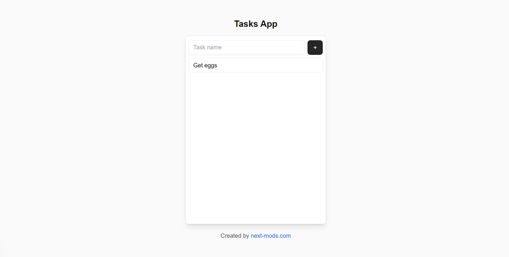
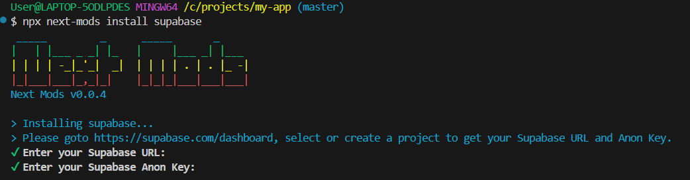
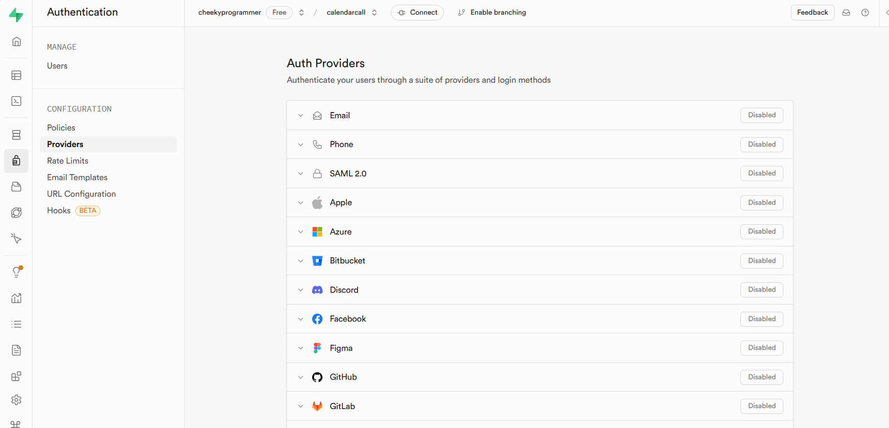
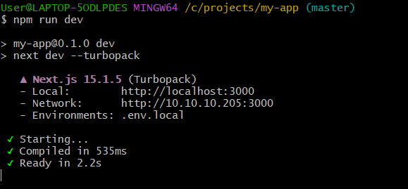

# Secure Tasks App



<!-- truncate -->

How would you like to build the most secure tasks app around in less than 5 minutes? With Next Mods you are able to get a fully working and secure todo list or task application that anyone can signin to and use.

If you follow along with this tutorial, you'll have this app built in just a few minutes. Let's get started.

## Prerequisites

To be able to build any Next.js application, you'll need the following setup on your computer:

- [Node.js](https://nodejs.org/en)
- [Git](https://git-scm.com/)
- Any code editor (IDE)
- A free [Supabase](https://www.supabase.com) account
- A Supabase project url and anon key. You can access your keys [here](https://supabase.com/dashboard/project/_/settings/api).
- A Google cloud account with client ID and secret keys to enable Google sign-in.

## Step 1 - Install Next.js

First we need to get a fresh install of Next.js setup to build ontop of. Open your code editor or git bash terminal and run the following command:

`npx create-next-app@latest <app-name>`

:::info
change {"<"}app-name{">"} to any name of your choosing.
:::

You can just accept the default options that it asks during the setup. This will install a copy of Next.js into the folder you are in.

## Step 2 - Initialize Next Mods

Next we need to change directories into the name you just created and then run the following command:

```bash
cd app-name
npx next-mods init
```

Next Mods will confirm where you want to save your environment variable and then complete initializing itself into the newly made Next.js setup.

## Step 3 - Install Supabase

You are now ready to install Supabase into your project by running the following command:

```bash
npx next-mods install supabase
```

You'll be asked for your Supabase URL and anon key. You can copy and paste your keys into the tool here.



You will be prompted to create various parts to Supabase, just accept the default options and accept the default values to continue setting up Supabase.

:::info
The default installation will create neccessary helper functions into `/lib/supabase`, authentication pages to `/auth/signin` and `/auth/signup` as well as setup a protected route at `/dashboard`
:::

## Step 4 - Configure Supabase Authentication

Navigate to your projects [authentication providers page](https://supabase.com/dashboard/project/_/auth/providers) and enable both email and Google providers. You'll be asked for your Google client ID and secret keys.



## Step 5 - Create Tasks Table

Next, we need to create the table to store everyone's tasks. You can just copy and pase the following block into the [SQL Editor](https://supabase.com/dashboard/project/_/sql/new) then click on Run:

```sql
create table
  public.tasks (
    id uuid not null default gen_random_uuid (),
    user_id uuid not null,
    task text not null,
    completed boolean null default false,
    constraint tasks_pkey primary key (id),
    constraint fk_user foreign key (user_id) references auth.users (id) on delete cascade
  ) tablespace pg_default;
```

You'll get a message saying `Success. No rows returned` once completed. Next we need to secure the table and allow users to access it.

## Step 6 - Setup RLS

I won't explain in much detail for the sake of keeping this short, but if you want to learn about RLS in more detail you can [read our guide](../../blog/how-to-enable-rls/) about it. In short, Row-Level Security (RLS) enables security at the table level. It's very powerful and neccessary for any application nowadays. We will be using it to make our tasks app secure and guarantees that each user can only access their own tasks.

Copy and paste the following block into the [SQL Editor](https://supabase.com/dashboard/project/_/sql/new) then press Run:

```sql
-- Enable RLS on the tasks table
ALTER TABLE tasks ENABLE ROW LEVEL SECURITY;

-- Insert Policy
CREATE POLICY "Allow logged-in users to insert tasks"
ON tasks
FOR INSERT
USING (auth.uid() IS NOT NULL);

-- Select Policy
CREATE POLICY "Allow logged-in users to select their own tasks"
ON tasks
FOR SELECT
USING (user_id = auth.uid());

-- Update Policy
CREATE POLICY "Allow users to update their own tasks"
ON tasks
FOR UPDATE
USING (user_id = auth.uid());

-- Delete Policy
CREATE POLICY "Allow users to delete their own tasks"
ON tasks
FOR DELETE
USING (user_id = auth.uid());
```

Again, you'll get a message saying `Success. No rows returned` once completed.
This enables RLS and tells Supabase to only allow anyone who's `auth.uid()` matches any `user_id` in the `tasks` table. The function `auth.uid()` is provided by the authentication system and is automatically provided by Supabase.

## Step 7 - Create UI

Next, we need to put it all together and be able to display everything to the user. For simplicity, I have created a Git repo preloaded with all the frontend files needed. If you left everything to defaults, there will be a route at `/dashboard` already that we will overwrite.

```bash
cd app/dashboard
git clone https://github.com/next-mods/tasks-app-components.git .
```

:::info
If you set the protected route to something other than `/dashboard` then change the above command to your directory.
:::

This will install the components neccessary to run the tasks app. You can browse the folder and explore and modify the components to your desire.

## Step 8 - Run Tasks App

You are now ready to try the app out. You can start the development server by running the following command:

```bash
cd ..
npm run dev
```



Open a browser and navigate to the site mentioned (usually http://localhost:3000 by default) and then goto your protected route.

:::info
The default protected route is http://localhost:3000/dashboard
:::

You will be redirected to a signin page since you are not signed in yet. You can sign up using email or Google by default. Try it out and see how you just set this app up in just a few minutes!

This secure tasks app is just an example of what you can do quickly with Next.js, Supabase and Next Mods. We will be adding more tutorials over time so keep an eye out for changes.

We hope you enjoyed this tutorial and found it useful. Check out the rest of our [tutorials](../docs/category/Tutorials/) for more reading. Thanks for reading!