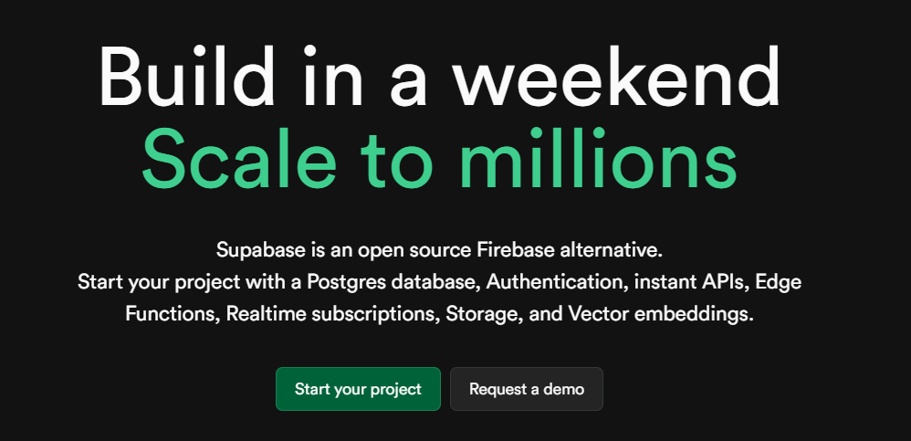
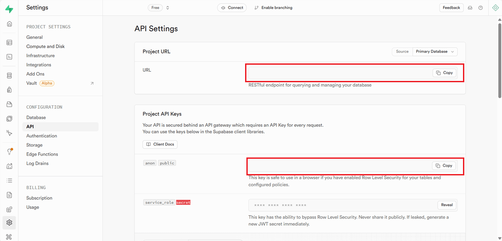
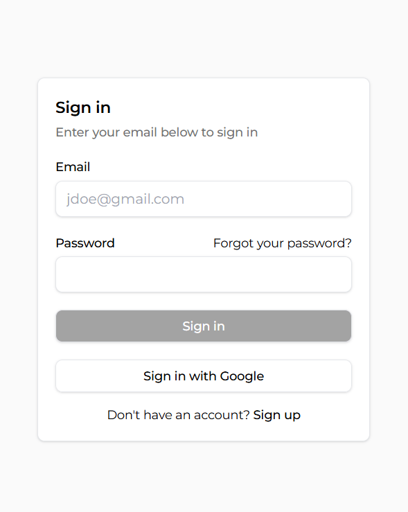

# supabase



This guide will walk you through integrating Supabase into your Next.js project using the Next Mods CLI tool. [Supabase](https://www.supabase.com) is an open-source Firebase alternative providing authentication, database, and real-time subscription features.

Save tons of time setting up authentication, middleware, signin/up forms, server actions and more with this function!

## Prerequisites

- Ensure you have Next Mods initialized. If not, you can do so by following the [Next Mods Getting Started](../getting-started.md) guide.
- A Supabase project with URL and ANON keys. You can get a [free account here](https://supabase.com/) and then once you have a project setup you can [get your keys here](https://supabase.com/dashboard/project/_/settings/api).
- (optional) A Google cloud project with a Client ID and Client Secret for Google authentication. You can [follow this guide](https://supabase.com/docs/guides/auth/social-login/auth-google?queryGroups=platform&platform=web) on how to set this up.

## Install Supabase

To start the installation, navigate to your Next.js project directory and run the following command:

```bash
npx next-mods install supabase
```

#### The installation is broken up into 5 steps:

### 1. Install Supabase Packages

This part is mandatory and automatic. This installs the neccessary Supabase JS package and SSR package to run Supabase with Next.JS properly. You can [read more about it](https://supabase.com/docs/guides/auth/server-side/nextjs) from Supabase.

### 2. Setup Environment Variables

You will be asked to enter your Supabase project URL and the project ANON_KEY. You can access these keys under the API tab of the Project Settings page of your Supabase project in your [dashboard](https://supabase.com/dashboard/projects) and then just paste them into the tool.



### 3. Setup Middleware

You will be asked if you want to create middleware. [Middleware](https://nextjs.org/docs/pages/building-your-application/routing/middleware) is code that is executed before a request is made to your application. It can be used in many ways and for different use cases but for us it will be used for authentication and authorization as well as server-side redirecting. You can skip this step but some features may not work.

### 4. Setup Authentication

This step will build you an authentication system into your project. We're not talking about a simple hello world page, but you'll get a full signin/signup page with neccessary callback routes to handle OAuth and Email authentication systems.

:::info

You will need to enable both the Email and Google authentication providers to allow for users to signup/signin. You can enable them [here](https://supabase.com/dashboard/project/_/auth/providers).

:::

<!--  -->

### 5. Create a Protected Route

A protected route blocks access to anyone who is not signed in. Anyone who visits the page/route that is not autenticated will be redirected to the signin page. This is a neccessary component to most applications. We create one for you automatically.

## What Now?

The next thing you should do is tweak the created pages to match your theme and then continue building or install another function! You now have a full suite of tools to handle a database, authentication, storage and more!

## Issues?

If you make any mistakes to the code and want to reset everything, run the following command:

```bash
npx next-mods install supabase repair
```

:::warning

Running a repair will overwrite the main files so make any backups if needed.

:::
